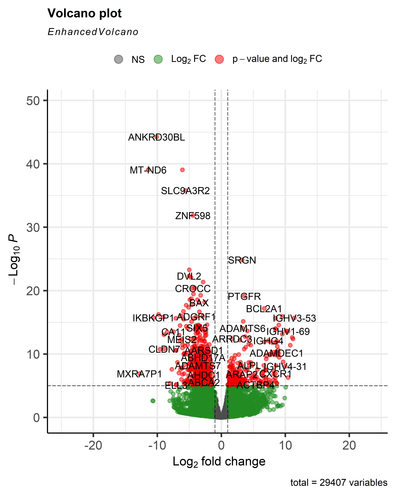
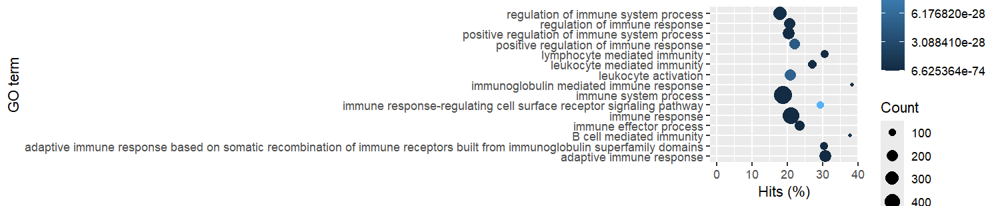
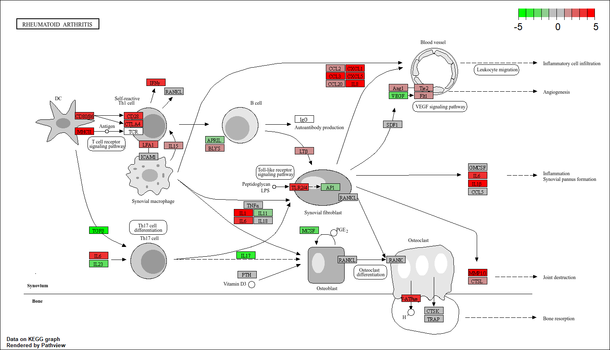
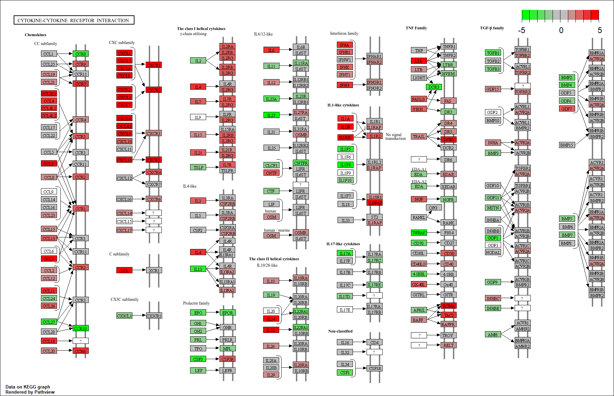

# Transcriptomische analyse van chemokine-signaling pathways bij reumatoïde artritis

## Inleiding

Reumatoïde artritis (RA) is een chronische auto-immuunziekte die wordt gekenmerkt door langdurige ontsteking van synoviale gewrichten. Door deze chronische ontsteking ontstaat uiteindelijk schade aan kraakbeen en botweefsel, wat kan leiden tot pijn, stijfheid en verlies van gewrichtsfunctie. Binnen het synovium spelen verschillende immuuncellen, waaronder neutrofielen, macrofagen, T-cellen en B-cellen, een belangrijke rol bij het onderhouden van de inflammatoire respons (Wright et al., 2021).

Cytokines en chemokines vormen essentiële regulatoren van deze immuunreacties. Vooral chemokines uit de CXC-familie, zoals CXCL1, CXCL8, CXCL10 en CXCL13, zijn sterk betrokken bij immuuncelrekrutering en inflammatie binnen RA-weefsel. Deze chemokines binden aan receptoren zoals CXCR1, CXCR2, CXCR3 en CXCR5, waardoor immuuncellen naar ontstoken gewrichten worden aangetrokken. Verhoogde expressie van deze pathways wordt geassocieerd met chronische inflammatie en ziekteprogressie bij RA-patiënten (Murayama et al., 2023). Daarnaast wordt CXCL10 beschreven als potentiële biomarker voor inflammatoire complicaties binnen RA (Makarem et al., 2024).

RNA-sequencing (RNA-seq) maakt het mogelijk om genexpressie op grote schaal te analyseren en verschillen tussen gezonde en zieke weefsels te identificeren. Met behulp van differential expression analyse kunnen genen en pathways worden opgespoord die betrokken zijn bij ziekteprocessen. In dit onderzoek werd RNA-seq analyse uitgevoerd op publieke datasets van Platzer et al. (2019) om differentieel geëxpresseerde genen en verrijkte pathways binnen RA te identificeren. Hierbij lag de focus op chemokine- en cytokinesignalering.

## Materialen en Methoden

Publieke RNA-seq datasets van gezonde controles en RA-patiënten afkomstig uit Platzer et al. (2019) werden gebruikt. De paired-end FASTQ bestanden werden uitgelijnd tegen het humane referentiegenoom GRCh38 met behulp van het R-package Rsubread(2.20.0). Vervolgens werd met featureCounts een count matrix gegenereerd op basis van een GTF-annotatiebestand.

Differential expression analyse werd uitgevoerd met DESeq2(1.46.0). Genen werden als significant beschouwd bij een adjusted p-value < 0.05 en een absolute log2FoldChange > 1. De resultaten werden gevisualiseerd met een volcano plot.

Om biologische processen en pathways te identificeren werd GO enrichment analyse uitgevoerd met goseq(1.58.0). Daarnaast werd KEGG pathway analyse gebruikt om verrijkte inflammatoire pathways te identificeren. Significante pathways werden vervolgens gevisualiseerd met Pathview(1.46.0). Om te visualiseren wat er gedaan is, is er een flowschema gemaakt. Ook zijn de scripts te vinden in de github, en de bijpasende en gebruikte packeges.

## Resultaten

De differential expression analyse liet een groot aantal significant differentieel geëxpresseerde genen zien tussen RA-samples en gezonde controles. Met vooral downgulation van genen in RA vergeleken met normale samples

  

*Figuur 1. Volcano plot van differentieel geëxpresseerde genen tussen reumatoïde artritis samples en gezonde controles. De rode punten zijn statisctisch verschillend tussen de 2 groepen. Met op de x-as de LOG FOLD Change, en op de y-as de p-Waarde*

GO enrichment analyse toonde sterke verrijking van immuun- en ontstekingsgerelateerde processen, waaronder cytokinesignalering, leukocytactivatie, immuuncelmigratie en inflammatoire responsen. Deze resultaten suggereren verhoogde activatie van pathways die betrokken zijn bij chronische inflammatie binnen RA-weefsel.

  

*Figuur 2. Visualisatie van de GO enrichment analyse. Grotere stippen vertegenwoordigen processen waarin meer genen betrokken zijn. Donkerdere kleuren geven een hogere significantie weer.*

KEGG analyse identificeerde meerdere significant verrijkte pathways, waaronder de Rheumatoid Arthritis pathway (hsa05323), de Cytokine-cytokine receptor interaction pathway (hsa04060) en de Toll-like receptor signaling pathway (hsa04620).

Binnen de Rheumatoid Arthritis pathway werd verhoogde expressie gevonden van meerdere inflammatoire cytokines, chemokines en immuunreceptoren die betrokken zijn bij synoviale ontsteking en gewrichtsschade.

  

*Figuur 3. KEGG Rheumatoid Arthritis pathway. Rood geeft verhoogde genexpressie weer en groen verlaagde genexpressie.*

Binnen de cytokine-cytokine receptor interaction pathway werd sterke upregulatie gevonden van meerdere chemokines uit de CXC-familie, waaronder CXCL1, CXCL2, CXCL5, CXCL8, CXCL10 en CXCL13. Daarnaast werden verhoogde expressieniveaus gevonden van de receptoren CXCR1, CXCR2, CXCR3 en CXCR5.

Deze resultaten wijzen op sterke activatie van chemokine-gemedieerde immuuncelrekrutering binnen RA-weefsel. Vooral de CXCL8–CXCR2 signaling as suggereert verhoogde neutrofielmigratie, terwijl CXCL13–CXCR5 betrokken lijkt bij B-celrekrutering en chronische inflammatie.

  

*Figuur 4. KEGG Cytokine-cytokine receptor interaction pathway met verhoogde expressie van meerdere chemokines en chemokinereceptoren. Rood geeft verhoogde genexpressie weer en groen verlaagde genexpressie.*

## Conclusie

De transcriptomische analyse liet sterke activatie zien van immuun- en ontstekingsgerelateerde pathways bij reumatoïde artritis. Vooral chemokines uit de CXC-familie en hun receptoren waren sterk upgereguleerd. De resultaten suggereren dat chemokine-gemedieerde immuuncelrekrutering een centrale rol speelt binnen de pathogenese van RA en mogelijk relevante therapeutische targets vormt.

# Bronnen
Murayama, M. A., Shimizu, J., Miyabe, C., Yudo, K., & Miyabe, Y. (2023). Chemokines and chemokine receptors as promising targets in rheumatoid arthritis. Frontiers in immunology, 14, 1100869. https://doi.org/10.3389/fimmu.2023.1100869

Khandia, R., Singhal, S., Sharma, K., & colleagues. (2025). Investigating potential biomarkers and therapeutic targets for patients with systemic lupus erythematosus (SLE) and rheumatoid arthritis (RA) through the utilization of cytokine profiling. Reumatología Clínica, 21(1), 101805

Wright, H. L., Lyon, M., Chapman, E. A., Moots, R. J., & Edwards, S. W. (2021). Rheumatoid Arthritis Synovial Fluid Neutrophils Drive Inflammation Through Production of Chemokines, Reactive Oxygen Species, and Neutrophil Extracellular Traps. Frontiers in immunology, 11, 584116. https://doi.org/10.3389/fimmu.2020.584116

https://bioinformatics-core-shared-training.github.io/cruk-summer-school-2020/RNAseq/extended_html/06_Gene_set_testing.html

Makarem, Y. S., Ahmed, E. A., Makboul, M., Farghaly, S., Mostafa, N., El Zohne, R. A., & Goma, S. H. (2024). CXCL10 as a biomarker of interstitial lung disease in patients with rheumatoid arthritis. Reumatologia clinica, 20(1), 1–7. https://doi.org/10.1016/j.reumae.2023.12.005

Szekanecz, Z., Vegvari, A., Szabo, Z., Koch, A. E. (2010). Chemokines and chemokine receptors in arthritis. Frontiers in Bioscience, 2, 153–167.

Szekanecz, Z., Koch, A. E., & Tak, P. P. (2011). Chemokine and chemokine receptor blockade in arthritis, a prototype of immune-mediated inflammatory diseases. The Netherlands journal of medicine, 69(9), 356–366.

Platzer, A., Nussbaumer, T., Karonitsch, T., Smolen, J. S., & Aletaha, D. (2019). Analysis of gene expression in rheumatoid arthritis and related conditions offers insights into sex-bias, gene biotypes and co-expression patterns. PloS one, 14(7), e0219698. https://doi.org/10.1371/journal.pone.0219698

Elemam, N. M., Hannawi, S., & Maghazachi, A. A. (2020). Role of Chemokines and Chemokine Receptors in Rheumatoid Arthritis. ImmunoTargets and therapy, 9, 43–56. https://doi.org/10.2147/ITT.S243636

AI is gebruikt voor een grammaticale spellings controle
