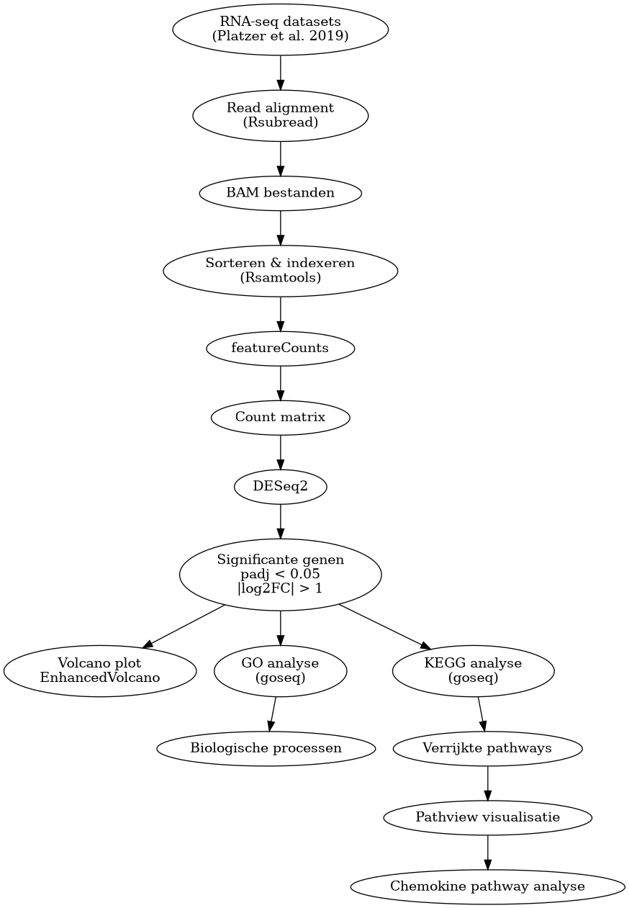
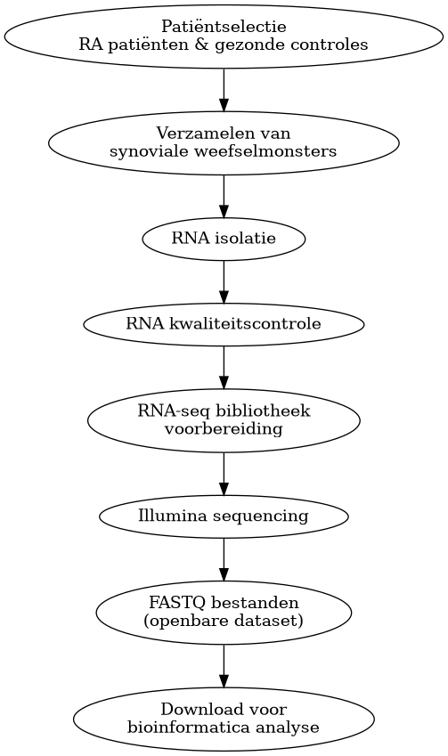

# Transcriptomische analyse van chemokine-signaling pathways bij reumatoïde artritis

## Inleiding

Reumatoïde artritis (RA) is een chronische auto-immuunziekte die wordt gekenmerkt door langdurige ontsteking van synoviale gewrichten. Door deze chronische ontsteking ontstaat uiteindelijk schade aan kraakbeen en botweefsel, wat kan leiden tot pijn, stijfheid en verlies van gewrichtsfunctie. Binnen het synovium spelen verschillende immuuncellen, waaronder neutrofielen, macrofagen, T-cellen en B-cellen, een belangrijke rol bij het onderhouden van de inflammatoire respons (Wright et al., 2021).

Cytokines en chemokines vormen essentiële regulatoren van deze immuunreacties. Vooral chemokines uit de CXC-familie, zoals CXCL1, CXCL8, CXCL10 en CXCL13, zijn sterk betrokken bij immuuncelrekrutering en inflammatie binnen RA-weefsel. Deze chemokines binden aan receptoren zoals CXCR1, CXCR2, CXCR3 en CXCR5, waardoor immuuncellen naar ontstoken gewrichten worden aangetrokken. Verhoogde expressie van deze pathways wordt geassocieerd met chronische inflammatie en ziekteprogressie bij RA-patiënten (Murayama et al., 2023). Daarnaast wordt CXCL10 beschreven als potentiële biomarker voor inflammatoire complicaties binnen RA (Makarem et al., 2024).

RNA-sequencing (RNA-seq) maakt het mogelijk om genexpressie op grote schaal te analyseren en verschillen tussen gezonde en zieke weefsels te identificeren. Met behulp van differential expression analyse kunnen genen en pathways worden opgespoord die betrokken zijn bij ziekteprocessen. In dit onderzoek werd RNA-seq analyse uitgevoerd op publieke datasets van Platzer et al. (2019) om differentieel geëxpresseerde genen en verrijkte pathways binnen RA te identificeren. Hierbij lag de focus op chemokine- en cytokinesignalering.

## Materialen en Methoden

Publieke RNA-seq-data van Platzer et al. (2019) werden gebruikt. Voor deze analyse werden vier gezonde controles en vier RA-samples geselecteerd. De gebruikte samples waren normal1 tot en met normal4 en rheuma1 tot en met rheuma4. De paired-end FASTQ-bestanden werden uitgelijnd tegen het humane referentiegenoom GRCh38.p14 met behulp van Rsubread versie 2.20.0 (Liao et al., 2019). Eerst werd met buildindex() een index van het referentiegenoom gemaakt. Vervolgens werden de paired-end reads met align() uitgelijnd. De resulterende BAM-bestanden werden gesorteerd en geïndexeerd met Rsamtools versie 2.22.0 (Morgan et al., 2025).

Vervolgens werd met featureCounts() uit Rsubread een countmatrix gegenereerd op basis van het genomic.gtf-bestand. Hierbij werd gene gebruikt als featuretype en gene_id als attribuut. De analyse werd uitgevoerd met paired-end reads. De featureCounts-methode is beschreven door Liao et al. (2014).

Voor de differential expression analyse werd DESeq2 versie 1.46.0 gebruikt (Love et al., 2014). De countmatrix werd gecombineerd met een experimentele tabel waarin de samples werden ingedeeld als normal of rheuma. Met de designformule ~ treatment werd het verschil in genexpressie tussen beide groepen bepaald. Een gen werd beschouwd als differentieel geëxpresseerd wanneer de adjusted p-value < 0,05 en de absolute log2FoldChange > 1 was.

De resultaten van de differential expression analyse werden gevisualiseerd met een volcano plot met behulp van EnhancedVolcano versie 1.24.0 (Blighe et al., 2024).

Voor de GO-enrichmentanalyse werd goseq versie 1.58.0 gebruikt (Young et al., 2010). Eerst werd uit het GTF-bestand informatie over de exonstructuur van de genen gehaald. Hiervoor werden GenomicFeatures versie 1.58.0 (Lawrence et al., 2013) en txdbmaker versie 1.2.0 gebruikt. Met GenomicRanges versie 1.58.0 werden de genomische regio's verwerkt (Lawrence et al., 2013). De exonlengtes per gen werden vervolgens gebruikt als biasinformatie voor goseq. Hiermee werd rekening gehouden met mogelijke vertekening van de enrichmentanalyse door verschillen in genlengte. De humane genannotatie werd verkregen met org.Hs.eg.db versie 3.20.0. De GO-analyse werd uitgevoerd voor de categorie Biological Process (GO:BP). Genen werden geselecteerd op basis van een adjusted p-value < 0,05 en een absolute log2FoldChange > 1.

Voor de KEGG-analyse werden KEGGREST versie 1.46.0 en Pathview versie 1.46.0 gebruikt. Pathview werd gebruikt om genexpressieveranderingen op KEGG-pathwaykaarten te visualiseren (Luo & Brouwer, 2013). De onderzochte pathways waren Rheumatoid arthritis (hsa05323), Cytokine-cytokine receptor interaction (hsa04060) en Toll-like receptor signaling pathway (hsa04620).

Een overzicht van de uitgevoerde analysemethode is weergegeven in het flowschema in Bijlage 1 en 2. De volledige scripts en gebruikte packages zijn opgenomen in de GitHub-repository.

## Resultaten

# Differential expression analyse

Het doel van de analyse was om verschillen in genexpressie tussen RA en gezonde controles te identificeren. Hiervoor werd met DESeq2 een differential expression analyse uitgevoerd op vier RA-samples en vier gezonde controles. Genen werden als differentieel geëxpresseerd beschouwd wanneer de adjusted p_value < 0,05 en de absolute log2FoldChange > 1 was.

In totaal werden 2.085 genen upgereguleerd en 2.487 genen downregulated in de RA-groep ten opzichte van de gezonde controles. De differentieel geëxpresseerde genen zijn weergegeven in de volcano plot (Figuur 1). Genen met een log2FoldChange > 1 waren verhoogd geëxpresseerd, terwijl genen met een log2FoldChange < -1 verlaagd geëxpresseerd waren.

*Figuur 1. Volcano plot van de differentiële genexpressie tussen RA-samples en gezonde controles. De x-as toont de log2FoldChange en de y-as de adjusted p-value. Genen met een adjusted p-value < 0,05 en |log2FoldChange| > 1 werden als differentieel geëxpresseerd beschouwd.*

# GO-enrichmentanalyse

Om te bepalen welke biologische processen betrokken waren bij de gevonden genexpressieveranderingen, werd een GO-enrichmentanalyse met goseq uitgevoerd. Hierbij werd rekening gehouden met verschillen in genlengte. De analyse liet vooral verrijking zien van immuun- en ontstekingsgerelateerde processen, waaronder processen gerelateerd aan leukocytactivatie, immuunrespons en immuuncelmigratie (Figuur 2).

*Figuur 2. GO-enrichmentanalyse van de differentieel geëxpresseerde genen. De grootte van de punten geeft het aantal genen binnen een GO-term weer en de kleur geeft de significantie van de verrijking weer.*

# KEGG-pathwayanalyse

Om de gevonden genexpressieveranderingen verder te onderzoeken, werd een KEGG-pathwayanalyse uitgevoerd. Hierbij werden de pathways Rheumatoid arthritis (hsa05323), Cytokine-cytokine receptor interaction (hsa04060) en Toll-like receptor signaling pathway (hsa04620) onderzocht.

Binnen de Rheumatoid arthritis pathway werden verschillende genen gevonden die betrokken zijn bij immuun- en ontstekingsprocessen (Figuur 3). Binnen de Cytokine-cytokine receptor interaction pathway werden onder andere CXCL1, CXCL2, CXCL5, CXCL8, CXCL10 en CXCL13 en de receptoren CXCR1, CXCR2, CXCR3 en CXCR5 gevonden (Figuur 4). Deze genen zijn betrokken bij chemokinesignalering en immuuncelrekrutering.

*Figuur 3. KEGG Rheumatoid arthritis pathway (hsa05323). Rood geeft een hogere en groen een lagere genexpressie weer.*

*Figuur 4. KEGG Cytokine-cytokine receptor interaction pathway (hsa04060). Rood geeft een hogere en groen een lagere genexpressie weer.*

## Conclusie

De transcriptomische analyse liet sterke activatie zien van immuun- en ontstekingsgerelateerde pathways bij reumatoïde artritis. Vooral chemokines uit de CXC-familie en hun receptoren waren sterk upgereguleerd. De resultaten suggereren dat chemokine-gemedieerde immuuncelrekrutering een centrale rol speelt binnen de pathogenese van RA en mogelijk relevante therapeutische targets vormt.

# Bronnen
Murayama, M. A., Shimizu, J., Miyabe, C., Yudo, K., & Miyabe, Y. (2023). Chemokines and chemokine receptors as promising targets in rheumatoid arthritis. Frontiers in immunology, 14, 1100869. https://doi.org/10.3389/fimmu.2023.1100869

Khandia, R., Singhal, S., Sharma, K., & colleagues. (2025). Investigating potential biomarkers and therapeutic targets for patients with systemic lupus erythematosus (SLE) and rheumatoid arthritis (RA) through the utilization of cytokine profiling. Reumatología Clínica, 21(1), 101805

Wright, H. L., Lyon, M., Chapman, E. A., Moots, R. J., & Edwards, S. W. (2021). Rheumatoid Arthritis Synovial Fluid Neutrophils Drive Inflammation Through Production of Chemokines, Reactive Oxygen Species, and Neutrophil Extracellular Traps. Frontiers in immunology, 11, 584116. https://doi.org/10.3389/fimmu.2020.584116

https://bioinformatics-core-shared-training.github.io/cruk-summer-school-2020/RNAseq/extended_html/06_Gene_set_testing.html

Makarem, Y. S., Ahmed, E. A., Makboul, M., Farghaly, S., Mostafa, N., El Zohne, R. A., & Goma, S. H. (2024). CXCL10 as a biomarker of interstitial lung disease in patients with rheumatoid arthritis. Reumatologia clinica, 20(1), 1–7. https://doi.org/10.1016/j.reumae.2023.12.005

Szekanecz, Z., Vegvari, A., Szabo, Z., Koch, A. E. (2010). Chemokines and chemokine receptors in arthritis. Frontiers in Bioscience, 2, 153–167.

Liao, Y., Smyth, G. K., & Shi, W. (2019). The R package Rsubread is easier, faster, cheaper and better for alignment and quantification of RNA sequencing reads. Nucleic Acids Research, 47(8), e47.

Liao, Y., Smyth, G. K., & Shi, W. (2014). featureCounts: an efficient general purpose program for assigning sequence reads to genomic features. Bioinformatics, 30(7), 923–930

Love, M. I., Huber, W., & Anders, S. (2014). Moderated estimation of fold change and dispersion for RNA-seq data with DESeq2. Genome Biology, 15, 550.

Young, M. D., Wakefield, M. J., Smyth, G. K., & Oshlack, A. (2010). Gene ontology analysis for RNA-seq: accounting for selection bias. Genome Biology, 11, R14

Luo, W., & Brouwer, C. (2013). Pathview: an R/Bioconductor package for pathway-based data integration and visualization. Bioinformatics, 29(14), 1830–1831.

Lawrence, M., Huber, W., Pagès, H., Aboyoun, P., Carlson, M., Gentleman, R., Morgan, M., & Carey, V. (2013). Software for computing and annotating genomic ranges. PLoS Computational Biology, 9(8)

Blighe, K., Rana, S., & Lewis, M. (2024). EnhancedVolcano: Publication-ready volcano plots with enhanced colouring and labeling. R package version 1.24.0. Bioconductor

Szekanecz, Z., Koch, A. E., & Tak, P. P. (2011). Chemokine and chemokine receptor blockade in arthritis, a prototype of immune-mediated inflammatory diseases. The Netherlands journal of medicine, 69(9), 356–366.

Platzer, A., Nussbaumer, T., Karonitsch, T., Smolen, J. S., & Aletaha, D. (2019). Analysis of gene expression in rheumatoid arthritis and related conditions offers insights into sex-bias, gene biotypes and co-expression patterns. PloS one, 14(7), e0219698. https://doi.org/10.1371/journal.pone.0219698

Elemam, N. M., Hannawi, S., & Maghazachi, A. A. (2020). Role of Chemokines and Chemokine Receptors in Rheumatoid Arthritis. ImmunoTargets and therapy, 9, 43–56. https://doi.org/10.2147/ITT.S243636

AI is gebruikt voor een grammaticale spellings controle

# Bijlage
Bijlage 1: Flowschema van de materiaal en methode

  

Bijlage 2: Flowschema van de materiaal en methode, van de monsters van de controle en rheuma personen

  

